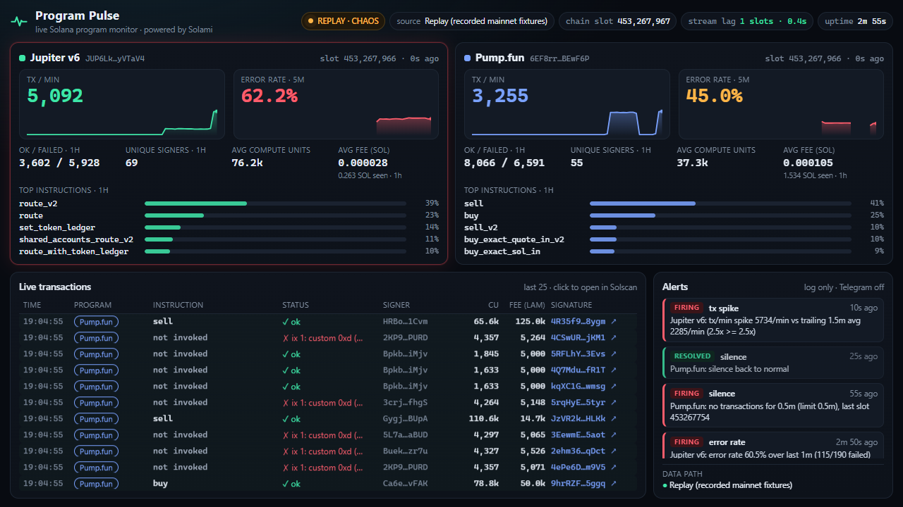

# Program Pulse

**Real-time health monitor for any Solana program, built on [Solami](https://solami.dev).**
Point it at one or more program IDs and get live tx/min, success vs failed, error rate, unique signers, top instructions (Anchor-decoded), compute units, fees, stream lag and alerts (Telegram + log) in a dashboard that updates every 750 ms.



<sub>Above: replay mode with the chaos schedule. Live mainnet on a Solami Free-tier key: [docs/screenshot-live.png](docs/screenshot-live.png).</sub>

## What you get

| | |
|---|---|
| **Rolling metrics per program** | tx/min (trailing 60 s), ok/failed counts, error rate (5 m / 1 h), unique signers (rolling 1 h), top instructions (1 h), avg/total compute units, avg/total fees, last-seen slot, 10-minute sparklines |
| **Instruction decoding** | Anchor 8-byte discriminators decoded from `idls/<programId>.json` (old or new Anchor IDL format); unknown ones shown as hex. Anchor event self-CPIs are filtered out of rankings |
| **Stream health** | lag = chain tip from Solami RPC `getSlot` minus the newest slot seen on the stream |
| **Alerts** | error rate above X% over N min, no transactions for N min, tx/min spike above M x trailing average. Firing, re-notify after a cooldown, then resolved. Sent to Telegram and the log |
| **Live tx feed** | last 25 transactions with instruction, status/error, signer, CU, fee and a Solscan link |
| **API** | `GET /api/state` (JSON) and `GET /api/stream` (Server-Sent Events) so you can build your own views or bots |
| **Replay mode** | try everything without a key: recorded mainnet transactions are replayed with real timing, plus an optional chaos schedule that triggers every alert type |

## Quick start (live mainnet)

Requires Node 22+.

1. Sign up at **[solami.dev](https://solami.dev/signup)** (free tier, no card).
2. Dashboard -> **API keys** -> create a standard key and copy it.
3. `git clone <this repo> && cd program-pulse && npm install`
4. `cp .env.example .env` and set `SOLAMI_API_KEY=...`
5. Pick programs: leave the defaults (Jupiter v6 + Pump.fun) or set `PROGRAM_IDS=<your program id>,...`
6. Optional: set `TELEGRAM_BOT_TOKEN` and `TELEGRAM_CHAT_ID` for alerts (create a bot with [@BotFather](https://t.me/BotFather)).
7. `npm run dev` and open **http://localhost:5173**

`npm run probe` tells you which Solami products your key can reach (it never prints the key).

### Try it without a key

```bash
npm install
npm run dev:replay        # replays fixtures/*.json (real mainnet txs) with the chaos schedule
# open http://localhost:5173
```

The chaos schedule repeats every 4 minutes: Pump.fun goes silent at 90-150 s (silence alert), Jupiter runs at 4x at 150-210 s (spike alert), and the recorded Jupiter error rate (~60%) trips the demo error-rate rule. `alerts.demo.yaml` uses short windows so all three fire within about three minutes. Re-record fresh fixtures any time with `npm run fixtures` (public mainnet RPC, `getSignaturesForAddress` + `getTransaction`).

### Production-style run

```bash
npm run build && npm start        # one process: watcher + built dashboard on http://localhost:8787
docker compose up --build         # same, in Docker (reads .env)
docker compose --profile replay up pulse-replay   # replay demo on :8788, no key
```

## Why Solami

Program Pulse is a streaming app, so it is built around Solami's streaming stack and drops down a tier at a time when a key or plan doesn't include a product. Every product below is called with the same `SOLAMI_API_KEY`.

| Solami product | Endpoint | How Program Pulse uses it |
|---|---|---|
| **Yellowstone gRPC** (primary) | `https://grpc.solami.dev`, key in `x-token` metadata | One `Subscribe` stream with a **server-side transaction filter** (`account_include = PROGRAM_IDS`, `vote: false`, failed txs included), so only the watched programs' transactions cross the wire. A `slots` filter lets lag be measured even when a program is quiet. |
| **gRPC slot replay** | `from_slot` on `SubscribeRequest` | On reconnect the watcher resumes at `last_slot + 1` (clamped to Solami's ~3,500-slot replay window) and dedupes signatures, so drops leave **no gaps**. On first connect it backfills `BACKFILL_SLOTS` (default 150, about 1 min) so the dashboard is warm instantly. Reconnects back off exponentially (Solami rejects >10 reconnects/min per IP). |
| **RPC `getSlot`** | `https://rpc.solami.dev/sol?api_key=` | The chain tip for the **stream-lag** metric (polled every 2 s) and the anchor slot for `from_slot`. |
| **Mirage** (fallback 1) | `wss://ws.solami.dev/mirage/stream/{id}` | The same Yellowstone `SubscribeUpdate` frames over a plain WebSocket. The watcher creates the saved filter with `POST /mirage/create` (or reuses `MIRAGE_SUBSCRIPTION_ID`) and decodes frames with the same code path as gRPC. |
| **WebSocket** (fallback 2) | `wss://ws.solami.dev/ws/sol` | `logsSubscribe({mentions:[program]})` + `slotSubscribe`; instruction names come from Anchor's `Instruction: X` log lines and CU from `consumed` lines. |
| **RPC** (fallback 3, works on Free) | `getSignaturesForAddress` + Solami's **`getTransactionsForAddress`** | `getSignaturesForAddress` with an `until` cursor (plus `before` paging) gives every signature, slot and error, so counts and error rates stay exact. Solami's own `getTransactionsForAddress` with `transactionDetails: "full"` returns the newest N full transactions in **one call**, which is used as a rolling sample for signers, instructions, CU and fees. All RPC calls share one token bucket (`RPC_MAX_RPS`). |

The source manager tries **gRPC -> Mirage -> WebSocket -> RPC polling**, logs one clear line per step (for example `Solami Yellowstone gRPC unavailable: Call cancelled (stream cancelled by server: gRPC streaming is likely not enabled on this Solami plan) -> falling back to Mirage WebSocket`), and while on a fallback **re-tries gRPC every 5 minutes**, so upgrading your plan or starting a gRPC trial switches the stream over without a restart. The dashboard's "data path" panel shows the same chain.

Not used (yet): **Blur** (decoded DEX events; Program Pulse is program-agnostic, so it decodes raw instructions instead), **Beam** (tx landing; this is a read-only monitor), **Webhooks** and the **Data API** (balances/history; a natural next step for per-signer drill-downs).

### What each Solami plan gets you

| Your key | Source used | Fidelity |
|---|---|---|
| gRPC enabled (Pro trial / plan / PAYG) | Yellowstone gRPC | Every transaction fully decoded, sub-second latency, gapless reconnects |
| Standard key with `MirageStream` + `MirageManage` | Mirage | Same as gRPC |
| Plan with WebSocket access | WebSocket logs | Every tx counted; instructions + CU from logs; no signer/fee |
| **Free tier** (verified) | RPC polling | Every tx counted (exact tx/min, error rate); signers/instructions/CU/fees from a rolling full-tx sample (shown as "sampled N%"), ~2 s latency |

## Watch your own program

```bash
PROGRAM_IDS=YourProgram1111111111111111111111111111111 npm run dev
PROGRAM_LABELS=YourProgram1111111111111111111111111111111:My Program   # optional display name
```

To decode instruction names, drop your Anchor IDL in `idls/<programId>.json`. Both the Anchor >= 0.30 format (explicit `discriminator` arrays) and the legacy format (names only; discriminators are derived as `sha256("global:<snake_name>")[0..8]`) work. Without an IDL you still get every metric, with instructions shown as hex discriminators. The repo ships the official Pump.fun IDL (trimmed to names and discriminators) and a names-only IDL for Jupiter v6.

## Alerts

Rules live in [`alerts.yaml`](alerts.yaml) (per-program scoping supported); env vars override thresholds:

```yaml
cooldown_minutes: 10
rules:
  - type: error_rate      # failed share above threshold over a window
    threshold_pct: 85
    window_minutes: 5
    min_tx: 30
  - type: silence         # no transactions for N minutes
    minutes: 3
  - type: spike           # tx/min >= multiplier x trailing average
    multiplier: 3
    window_minutes: 1
    baseline_minutes: 15
    min_tx_per_min: 20
```

Busy DEX and launchpad programs fail 40-75% of the time (bots, slippage), so tune `error_rate` per program. Each alert goes to the log, to Telegram (HTML message with a Solscan link) when configured, and to the dashboard (toast + alerts panel + red card outline).

## Configuration

All settings are environment variables (see [`.env.example`](.env.example)):

| Variable | Default | Purpose |
|---|---|---|
| `SOLAMI_API_KEY` | - | Your Solami key (RPC, WebSocket, Mirage; also the gRPC `x-token` unless `SOLAMI_GRPC_TOKEN` is set) |
| `SOLAMI_GRPC_ENDPOINT` | `https://grpc.solami.dev` | Region-pin with `fra.` / `ams.` / `nyc.` |
| `SOLAMI_RPC_URL` | `https://rpc.solami.dev/sol` | `?api_key=` is appended automatically |
| `PROGRAM_IDS` | Jupiter v6, Pump.fun | Comma-separated program IDs |
| `SOURCE` | `auto` | `auto`, `grpc`, `mirage`, `ws`, `rpc` or `replay` |
| `COMMITMENT` | `confirmed` | `processed`, `confirmed` or `finalized` |
| `BACKFILL_SLOTS` | `150` | gRPC `from_slot` warm-up on first connect (max 3500) |
| `GRPC_UPGRADE_INTERVAL_MIN` | `5` | Retry gRPC while on a fallback |
| `RPC_MAX_RPS` | `4` | Shared RPC budget (Free tier allows 5 req/s) |
| `POLL_INTERVAL_MS` / `SAMPLE_INTERVAL_MS` / `SAMPLE_SIZE` | `2000` / `4000` / `10` | RPC polling cadence and sample size |
| `TELEGRAM_BOT_TOKEN` / `TELEGRAM_CHAT_ID` | - | Enable Telegram alerts |
| `ALERTS_FILE` | `alerts.yaml` | Alert rules file |
| `PORT` | `8787` | Watcher HTTP port (dashboard dev server proxies `/api` to it) |

## Architecture

```
                 Solami
   ┌──────────────────────────────────────────┐
   │ gRPC  grpc.solami.dev  (x-token,         │      watcher/ (Node 22, TypeScript)
   │       server-side tx filter, from_slot)  │──┐   ┌────────────────────────────────────────┐
   │ Mirage ws.solami.dev/mirage/stream/{id}  │──┤   │ SourceManager  auto fallback + upgrade │
   │ WS     ws.solami.dev/ws/sol (logs)       │──┼──>│   -> normalize (Yellowstone / RPC JSON)│
   │ RPC    rpc.solami.dev/sol                │──┘   │   -> IdlRegistry (Anchor discriminators)│
   │        getSlot / getSignaturesForAddress │      │   -> Pipeline (signature dedupe)        │
   │        getTransactionsForAddress         │      │   -> Aggregator (1 s ring buckets x 1 h,│
   └──────────────────────────────────────────┘      │      per-minute ix counts, signer map)  │
        fixtures/*.json -> ReplaySource ────────────>│   -> AlertEngine -> log + Telegram      │
                                                     │   HealthTracker (RPC getSlot -> lag)    │
                                                     │   HTTP: /api/state, /api/stream (SSE)   │
                                                     └──────────────────┬─────────────────────┘
                                                                        │ SSE every 750 ms
                                                     dashboard/ (Vite + React, no chart libs)
```

- **Memory-bounded rolling window:** each program keeps 3,600 one-second buckets (tx, failed, CU, fees, detail count), 60 per-minute instruction maps and a signer map pruned to 1 h, so memory stays flat no matter how long it runs.
- **Exactly-once counting:** signatures are deduped (200k LRU) across gRPC replay overlaps and source switches; RPC samples only *enrich* detail stats and never double-count rates.
- **Timestamps:** confirmed transactions often have `blockTime = 0`, so times are estimated from slot height against the latest observed tip.
- The Yellowstone client is `@triton-one/yellowstone-grpc@4.0.2`, the last pure-JS (`@grpc/grpc-js`) release, so it runs on Windows, macOS and Linux without native binaries.

## Development

```bash
npm run dev          # watcher (tsx watch) + dashboard (Vite) together
npm run dev:replay   # same, fed from fixtures with chaos + demo alert rules
npm test             # vitest: aggregator, alert rules, decoding, slot replay
npm run lint         # eslint + typecheck both workspaces
npm run build        # watcher -> watcher/dist, dashboard -> dashboard/dist
npm run probe        # which Solami endpoints your key can reach
npm run fixtures     # re-record fixtures from public mainnet RPC
npm run screenshot   # 1280x720 PNG of the running dashboard (uses installed Chrome/Edge)
```

## Known limitations

- On the Free tier (RPC polling), signers, instructions, CU and fees are computed from a rolling sample (about 1-5% of transactions for very busy programs); counts, error rates and tx/min are exact.
- The gRPC and Mirage paths follow Solami's documentation and were exercised up to authentication and the server's response on a Free key (unary gRPC `GetSlot` succeeds; the streaming `Subscribe` is cancelled because gRPC streaming is off on Free). Full streaming needs a plan with gRPC or a Mirage-enabled standard key.
- Metrics live in memory; restarting the watcher resets the 1 h window (gRPC backfill refills about the last minute).

## License

[MIT](LICENSE)
